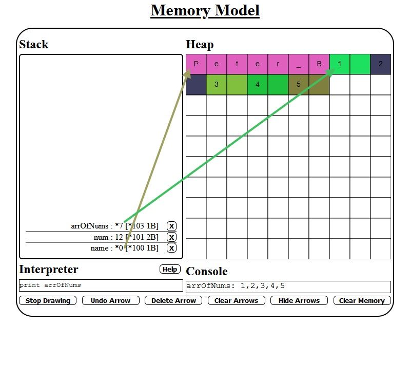
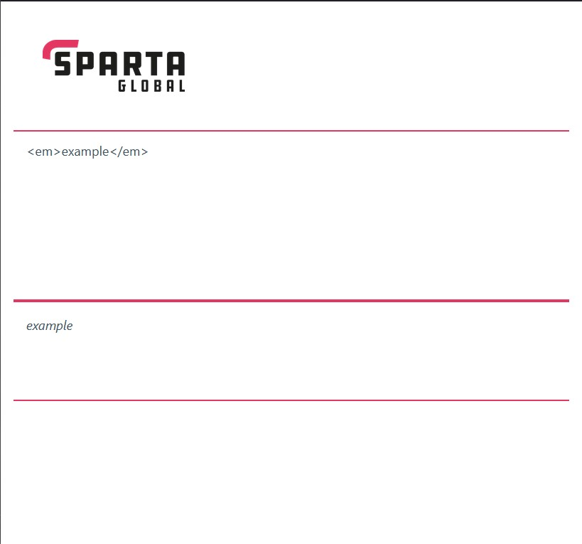

# MyTools
A collection of the minor tools I've put together for professional use.

## The Memory Model
Used by myself and many other trainers during C# and Java lessons to demonstrate to trainees how data is handled in memory, what the Stack and the Heap are and how they're used.

[Memory Model](./Memory_Model)

## HTML Renderer
Used during my video production for Sparta Global, in particular the HTML Short, a 10 minute introduction to the basics of HTML, where instead of using potentially overly-complex free editors that are prone to change or paid-for solutions, I threw together this extremely simple HTML renderer, so that the basics could easily be focused on.

[HTML Renderer](./HTML_Renderer)