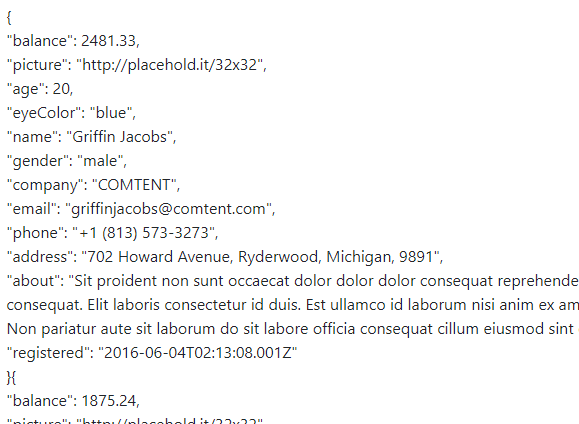

# MyTools
A collection of the minor tools I've put together for professional use.

## The Memory Model
Used by myself and many other trainers during C# and Java lessons to demonstrate to trainees how data is handled in memory, what the Stack and the Heap are and how they're used.


[Memory Model](./Memory_Model)

## HTML Renderer
Used during my video production for Sparta Global, in particular the HTML Short, a 10 minute introduction to the basics of HTML, where instead of using potentially overly-complex free editors that are prone to change or paid-for solutions, I threw together this extremely simple HTML renderer, so that the basics could easily be focused on.


[HTML Renderer](./HTML_Renderer)

## Csv Downloader
A small JS utility class that allows you to create and download .csv files from JSON data.

No sexy screenshot for this one, just go see the file [here](./CsvDownloader/CsvDownloader.js) and the demo [here](./CsvDownloader/Demo.html).

## NMaker Utilities
My own light JS Front End framework.

The use case is simply: given a single lump of JSON data, have a bunch of tools to efficiently and effectively manipulate that data, giving me full control over it and also cutting down on server calls by a lot.

The `NMaker` static class contains some helper functions as well as doubling as the source of truth for the data under `NMaker.data`, `NMaker.filteredData` and `NMaker.pagedData`.

All components load from this data, and listen in on the `updatedData` and `updatedPagedData` events that the corresponding components set up on the `document`.

To use the system, first call `NMaker.init(data)` with your JSON data and then create whatever components you want by instantiating an object of that component.

The objects create their corresponding HTML immediately, but calling `[component].make[Component](attributes)` will remake them, removing them from where they were.

The styling defaults make plentiful use of Bootstrap, but it is not required (all styling is provided via `attributes.classes` so any custom CSS classes can be used).

#### Common Attributes
Attributes don't have to be provided, they fall back on defaults.

| **Attribute** | **Effect** |
| --- | --- |
| `id` | The html id of the table generated, defaults to `"[componenet code]" + Date.now()` |
| `parentSelector` | the css selector for determining the parent element, defaults to `body` |
| `classes` | the css style classes to apply. Must be an object where each parameter matches the HTML element that you want those classes to apply to, and the value an array of strings of the classes you want to apply. Note if no classes are defined for an element it defaults to the following bootstrap classes, but if any are defined for an element, all defaults for that element are lost:  |
```js 
{
    table : ["table", "table-striped", "table-bordered"],
    th : ["h5", "align-text-bottom"],
    td : ["text-body-secondary"]
}
```

#### Given well-formed JSON


#### When called (with optional options)


#### Then a Table is made


#### Ideas:
 - LinkMaker - makes button-like link from given url string and `linkOptions`
 - DropDownMaker - makes a dropdown list from given options (currently a hardcoded part of `filterMaker`)
 - PrintMaker - makes a print button that takes in the id of the div to print
 - FileUploadMaker - At the least, encorporating CsvDownloader

### TableMaker
The main component of `NMaker`.

A `TableMaker` object creates the tables that it represents and manages the state of that table. Make a new `TableMaker` with your desired `attributes`, the API that the TableMaker uses to configure the table, defaults and descrtiption below. 

#### TableMaker API
The tableMaker functions simply: through data provided to the `attributes` input, the table generated can be defined and customised.

| **Attribute** | **Effect** |
| --- | --- |
| `sorting` | an array of strings for the columns that you want sorting functionality on, by json parameter name. Uses `sortingOrientation` to track state. Defaults to `false` |
|  `currency` | an array of strings for the columns that you want to be displayed as currency, by json parameter name. Defaults to `false`|
| `hide` | an array of strings for the columns that you don't want to be in the table |


TODO:
- Add conditional formatting. Within classes, also have `[ClassName]If` i.e. `buttonIf` where the first string in the array is actually a boolean conditional, which can be `Eval()`ed and the rest of the array applied as classes if the eval was true. 

### PaginatorMaker

To Explain, but the code is up.

### FilterMaker
A dynamic filtering component.
